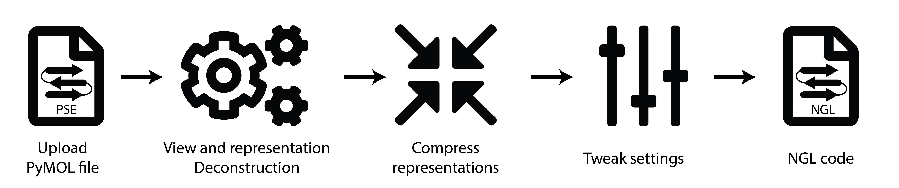
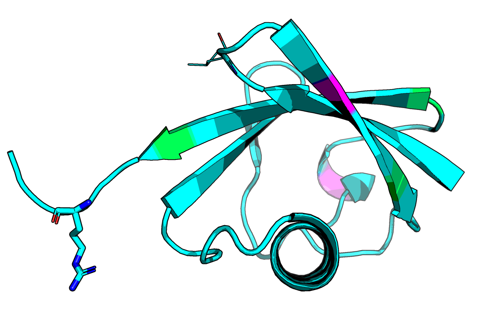
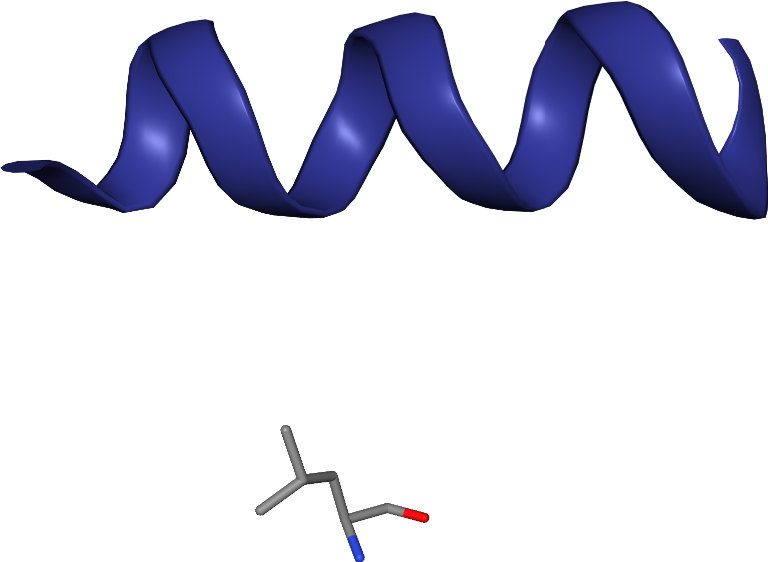
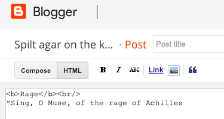
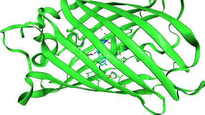
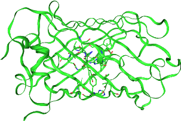

# PyMOL-to-NGL transpiler
A script to convert a PyMOL PSE file to a easy to implement NGL.js view.

This is available as the script itself and [a web app (temp URL)](https://ngl.matteoferla.com).

## Aim

The aim of this app is to provide a way for a user to easily generate a web-ready output that can be pasted into a webpage editor resulting in an iteractive protein view.

Therefore the intended audience are biochemists that may not have any web knowledge that wish to display on their academic pages their researched protein.

A future possibility is that in collaboration with specific journals this could be rolled out in papers.

### Transpiler

The script, and associated web app, gets a PSE file and converts it to a copy-pastable piece of code.

If needed, this piece of code can include the PDB data itself, thus removing the need to store the PDB file somewhere.

### Image

Whereas, the most commonly used protein viewing software is PyMol, most researchers render a view and label/draw upon it in Paint/Powerpoint/Photoshop.

Consequently, the code allows users to generate code than when a given static image is clicked it results in a NGL viewer div. Example: [demo](http://www.matteoferla.com/LZTR1.html).

The mouse image can be found [here](images/clickmap.jpg).

## Script functionality
The script `PyMOL_to_NGL.py` has the class `PyMolTranspiler`. Which accepts different starting values.
If Pymol is installed on the system and the system is not a Windows machine, the filename of the PSE is passed and processed.

which can be initialised thusly:

    >>> trans = PyMolTranspiler(view=get_view_output_as_string, reps=interate_output_as_string, pdb=file_of_saved_pdb)
    >>> trans.to_html_line()

        <!-- **inserted code**  -->
        
        
        <!-- **end of code** -->
        
The The class initialises as a blank object with default settings unless the `file` (filename of PSE file) or `view` and/or `reps` is passed.
For views see `.convert_view(view_string)`, which processes the output of PyMOL command `set_view`
For representation see `.convert_reps(reps_string)`, which process the output of PyMOL command `iterate 1UBQ, print resi, resn,name,ID,reps`
    
The source of the NGL code can be changed:

    >>> trans.to_html_line(ngl='ngl.js')
    
## To do
* Maybe arrows and labels.
* Automate the retrieval of PyMOL data: currently text output is parsed. But a wrapper for the application or using the pymol library would be best.

For now, the third party js is naughtly served as a copy without git&ndash;submodul'ing it, because it's a private repo.

## Example
Here is a rather funny view in PyMOL and the equivalent snapshot transpiled to NGL (link to [example.html](http://www.well.ox.ac.uk/~matteo/junk/example.html)).

## Where
The script output a secret temporary page that can be shared, but also a block of code that can be used by the user on their sites.       
About the latter usage, to use the output code one needs access to the raw HTML. Not necessarily of the whole page as only a small part is fine. For example:

In the first case, the HTML code is hidden as one sees what one gets as an end result. In the second case, the HTML code is visible: words between tags such as &lt;b&gt; are not styled. In most cases JS can be added here.

## data-toggle='protein'
Extra functionality can be optionally added, including the ability to create links that control the protein.

Namely, `<a href='#viewport'>you see this text as a link</a>` is technically called an anchor element and is commonly called a link.
Like all HTML elements, everything with the within the lesser-than and greater-than symbols controls its behaviour.
The `href` attribute () tells the browser where to point, either to another page or to an element within the page &mdash;the hash symbol means the elements `id` attribute, its unique name.
Following JQuery and Bootstrap behaviour, if a `data-toggle='protein'` is added the code will know to change the protein depending on the other tags.
If a `data-residue='23'` is added a residue index and it's neighourhood is focused on (for chains, use a synthax like `23:A`), for a region use `data-region='23-45'`.
Optionally, `data-title` controls the text that appears in the viewer, while `data-color` (US spelling) controls the colour of the selection.
The default values for the latter are green for regions and hotpink for residues &mdash;See [here for HTML colour names](https://htmlcolorcodes.com/color-names/), for a specific PyMOL colour RGB value, follow the commands in [this PyMOL Wiki page](https://pymolwiki.org/index.php/Get_Color_Indices) and then [convert it to a hex code](https://htmlcolorcodes.com/color-picker/).

## Issues
If it does not work on your site, it may because some information is lost when you added it.

Try adding to your page:

    I am definitely in the correct HTML editor mode as this is <b>enboldened</b> and this is blue.

And view it.

* If the emboldened text is not bold, but has `&gt;b&lt;` before it, you were ending your html page in an editor that showed you the end formatting (WYSIWYG) not the raw HTML code.
* If the emboldened text was bold, but the ought-to-be blue text was not, they the editor may be stripping JS for security reasons or you switched from raw to WYSIWYG before saving and it stripped it.
* If both displayed as hoped then it is trickier.

On Chrome show the console. To do so press the menu button at the top right next to the your face, then `More tools...` then `Developer tools`.
Here you can see what went wrong with your page. Is there a resource not found error? If so, you may have set it to fetch something that was not there or in that location.

If you thing, the fault is in the code please email me.

If the demo image gives you an unsolicited black, that means something went wrong with the parsing of the parts. See the `else {return 0x000000} //black as the darkest error!` line? That is there as a last ditch.
To debug this yourself, open the console and type `protein.structure.eachAtom(function(atom) {console.log(atom.chainid);});` or `atom.resno` or other property of `atom` until you figure out what is wrong with your structure.
I am aware of two unfixed bugs, one is the CD2 atom in histidine residues with different colored carbons and the other is the absence of shades of gray (_e.g._ `gray40`) in the color chart.

## Technicalities
### Parts to convert
Three parts are needed to convert a `.pse` file into a NGL view.
* the model
* orientation
* representation
    * lines, sticks, cartoon etc.
    * colors
    * surface (handled differently in NGL)

Additionally, there are
* text/labels which are normally added in photoshop by people...
* arrows, which are great, but in PyMol are from the add-on script `cgo_arrows` and not part of the native code

### Notes on PSE side
A Pse is encoded, so there is no way to read it except with Pymol. But Pymol can reveal it's secrets.
### Orientation
I was driven spare with converting the orientation. It simply was a question of inverting the sign on the $\vec{x}$ and $\vec{z}$ of the rotational matrix, multiplying it by the absolute of the scale and adding the origin of rotation's position with inverted sign.
For more see [my notes on the conversion of the view](notes_on_view_conversion.md)

### Representation
The atom information is kept in `reps`. Say `PyMOL>iterate 1UBQ, print resi, resn,name,ID,reps`.
This is an integer with no information give. However, looking at how it behaves it is clear it is a binary number where each position controls lines, sticks, cartoon and surface.

0. Sticks
1. Spheres
2. Surface
3. Label (needs additional variable)
4. Non-bounded spheres
5. Cartoon
    * putty is a special cartoon rapresentation: `iterate sele, resi,name,reps,cartoon`
6. Ribbon
7. Lines
8. Mesh
9. Dots
11. Non-bounded &mdash;Ligand (HETATM) properties are otherwise the same
12. Cell

### Primitive equivalence table

| PyMol  | PyMol reps bit | NGL |
| ------------- | --- |------------- |
| `spheres`  | 000000000010 | `spacefill` |
| NA | &mdash; | `ball+stick` |
| NA | &mdash; | `helixorient` |
| `lines`  | 000010000000 | `line` |
| `sticks`  | 000000000001 | `licorice`  |
| NA | &mdash; | `hyperball` |
| NA | &mdash; | `trace` |
| `ribbon` | 000001000000 | `backbone` |
| NA | &mdash; | `ribbon` |
| `cartoon` | 000000100000 | `cartoon` |
| `surface` | 000000000100 | `surface` | 
| `label` | 000000001000 | `label` |
| `non-bounded spheres` | 000000010000 | &lowast; |
| NA | &mdash; |`rope`|
| "putty"* | &mdash; | `tube` |
| `mesh`   | 000100000000 | &lowast; |
| `dots`  | 001000000000 | `point` |
| `non-bounded` | 010000000000 | &lowast; |
| `cell` | 100000000000 | `cell` |

&lowast;) The two differ in how this is handled.

### The SS problem
NGL does not assign secondary structure. Therefore, if not specified everything will be a turn/loop, so both the helices and sheet (especially) will look anemic.

The script `SS.py` can generate this in PDB file via PyMol. However, the generated `SHEET` definition is not as it ought to be, as it gives out mulitple separate strands as opposed to a single multistrand sheet &mdash;It works though, so who cares? 

### Complicated?
The code seems a bit complex when it comes to selections. The most obvious thing to do is to just have a list of the atoms with a given color and representation. However, this has two problems:
first, the NGL atom serial does not always map to the same PyMOL atom ID as both try to fix issues in PDB atom id, the second is that having a list of thousands of ids quickly becomes heavy.

## Python3 compiled Pymol in Ubuntu
This app requires Python3 compiled Pymol. This is not a simple job on a Linux machine. This is straightforward on a Mac or PC installation, but not on Linux.

The Pro version of PyMol is a 'portable' and I could not make it use Python 3.
Using `conda install -c schrodinger pymol` with a 3.7 Conda won't work.
There appearts to be a `python3-pymol` aptitude package for Ubuntu Disco Dingo, but not earlier versions (current stable is Bionic Beaver).

The following commands will compile PyMol opensource under Python3.

    #get all prerequisites
    sudo apt-get install python3 #or anaconda3
    sudo apt-get install python3-dev libglm-dev freeglut3-dev libglew-dev libpng12-dev libfreetype6-dev build-essential libxml++2.6-dev
    pip3 install pmw numpy
    prefix=/opt/Pymol/
    modules=$prefix/modules
    mkdir -p $prefix
    sudo python3 setup.py build install --home=$prefix --install-lib=$modules --install-scripts=$prefix
    #add the module to python
    sudo echo $modules > /usr/lib/python3/dist-packages/pymol.pth

## Licence
* [PyMOL](https://github.com/schrodinger/pymol-open-source/blob/master/LICENSE) is a trademark of Schrodinger, LLC, and can be used freely.
* NGL uses an MIT licence.
