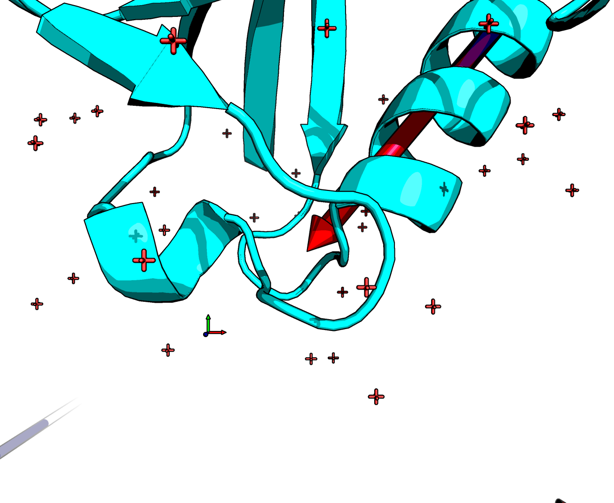
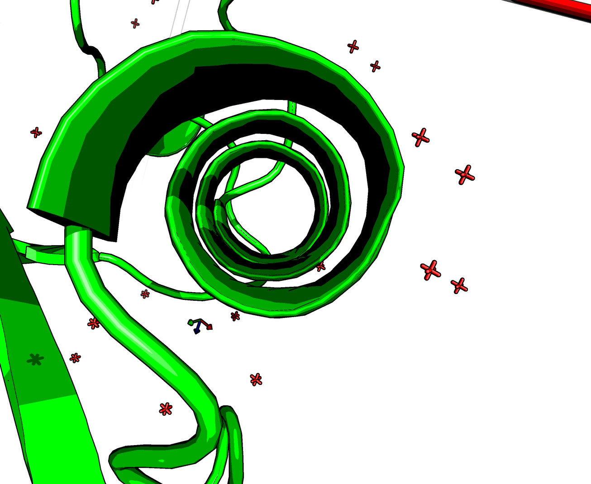
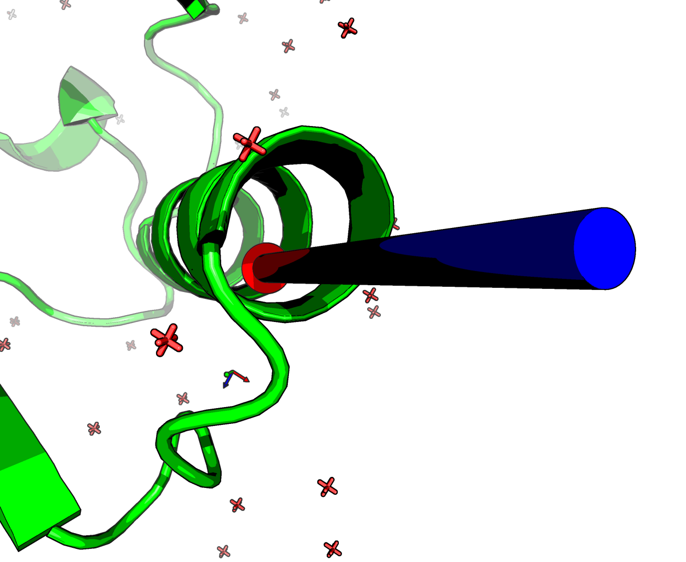
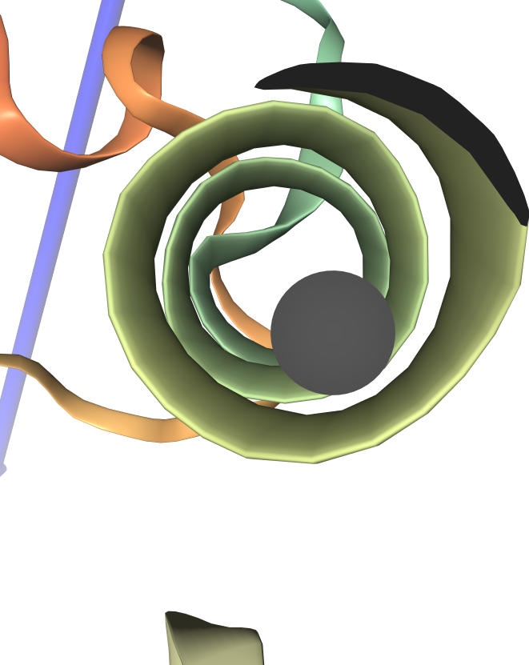

# Findings so far
Both NGL viewer and PyMol respect the model origin and use the same scale (&Aring;) as expected, but the camera works with slightly different maths.
In PyMol the command `get_view` gives a 18-element array, while the `stage.viewerControls.getOrientation()` gives a 4x4 transform matrix.

# Mods
Herein I am using the PyMOLWiki PyMOL-scripts `axes` and `cgo_arrow` and in the case of NGL, I have loaded separately 3.js, just in case there is so weirdness between the THREE objects and the NGL imported ones.

## PyMOLian matrix
### Rotation
The PyMol matrix is a composite, where the first nine are a reshaped column-major 3x3 rotation matrix.
The determinant is 1 as expected, but that is where it stops making sense to me.
### Depth
The next three elements represent the camera depth, basically. Technically defined as the "origin of rotation relative to the camera in camera space". The first two elements are generally nearly zero.
This makes me think this is the scale factor as seen in the `stage.viewerControls`'s `orient` method, which uses the 4x4 matrix and uses THREE.js decompose method to get transform, quaternion and scale. Where only the z element is used as it is three repeated numbers. It seems to correspond but with inverted sign.
### Translation
The next three after that are the origin of rotation (in model space). These seem to correspond the the translation matrix present in NGL's output, but with inverted sign.     
I am not sure how, but this could be due to a potential different handedness of the representation.

## Conversion of position
In NGL the following is seen:

    //position from PyMOL
    //gained from the PyMOL cmd `get_view`
    var position = (new THREE.Vector3).fromArray([29.512767792, 18.998723984, 16.735183716]);
    shapeComp.setPosition(position) //is in the right place
    shapeComp.position //is negative
while moving the camera to that position manually...

    m4=stage.viewerControls.getOrientation()
    var tmpP=new THREE.Vector3, tmpQ=new THREE.Quaternion, tmpS=new THREE.Vector3
    m4.decompose(tmpP, tmpQ, tmpS)
    tmpP //is negative
    // quite different: {x: -36.822995894338874, y: -23.153848086068756, z: -26.707327314094638}

While the camera depth was 21 &Aring;.

    #Getting the camera location relative to the transformed origin
    #by multiplying by rotation matrix and adding the translation origin
    np.matmul(rotation,depth)+translation
    [14.47072807 -0.04127116 24.18044467]

In PyMOL we can plot the arrow

    cgo_arrow [14.47072807, -0.04127116, 24.18044467], [29.512767792, 18.998723984, 16.735183716], gap=0
In NGL we get

    var shape2 = new NGL.Shape( "shape" );
    var teleposition =(new THREE.Vector3).fromArray([14.47072807, -0.04127116, 24.18044467]);
    shape2.addArrow(position1=teleposition,position2=position,color=[1,1,1],radius=1,name='camera');
    var shapeComp2 =stage.addComponentFromObject(shape2);
    shapeComp2.addRepresentation( "buffer" );
        
This give a nice arrow that appears to be where the camera should be, proving that the data should work.
Accepting that the numbers are opposites only for position...

    var antiposition = (new THREE.Vector3).fromArray([-position.x,-position.y,-position.z]);
    reset_origin(antiposition)
    
Oddly, getting the absolute positive value for scale works in NGL, while the negative mirrors it.
In PyMOL the absolute negative works, while the positive gives oblivion.

## Conversion of rotation
Is the PyMOL rotation matrix a normal one?
Setting the rotational matrix to normal axes, e.i. [ 1, 0, 0; 0, 1, 0; 0, 0, 1] in PyMol gives a different view than with NGL set to a blank Quaternion (1+0i+0j+0k; Q._w=1).
But PyMOL does seem to respect perfectly the axes. So the issue is with my understanding of rotations with 3.js.
Curiously, trying to debug it give some weird failures:

    shapeComp.controls.rotation.setFromRotationMatrix(rotation) //fails
    rotQ= new THREE.Quaternion
    rotQ.setFromRotationMatrix(rotation) //fails
The reverse produces a failure, so it is not too worrisome. It just means some thing is weird in THREE.
 
    m4.decompose(tmpP, tmpQ, tmpS)
    var tmpR = (new THREE.Vector3).applyQuaternion(tmpQ)
    
# The camera object
NGL has a camera object. Which has some properties that may be useful. And in fact, the setter `orient` plays with its position. But similarly to PyMOL.

    v.camera.position.copy(teleposition)
    v.updateZoom()
    stage.viewerControls.changed()
    
The position messes up the scale, resulting in a mixed signs. zooming out forces it to be zero or higher.
The camera location is the true origin and not the given one.
In the setter, a workaround is seen: `v.camera.position.z = -tmpS.z` as opposed to `v.camera.position.copy(tmpS)`
Which means, that it is a position not in the object grid but in the view grid, like in PyMOL.

However, the rotation cannot be given as easily.

        v.camera.isEuler
        //Its an Euler vector+angle
        var rotE = (new THREE.Euler).setFromRotationMatrix(rotation)
        ▶ Euler {_x: NaN, _y: -0.32955749899946274, _z: -1.7862372039070724, _order: "XYZ"}
        
In Python, the following check to see if all is good, finds that it is a bit off.

    print(np.dot(rotation.transpose(), rotation))
    [[ 9.99998397e-01 -1.81616106e-07  6.17881021e-07]
     [-1.81616106e-07  9.99999296e-01 -1.22734764e-08]
     [ 6.17881021e-07 -1.22734764e-08  9.99997580e-01]]

Fixing the above

    var rotE = (new THREE.Euler).setFromRotationMatrix(rotation);
    rotE._x=1.94355013;
    rotE._y=-0.63433182;
    v.camera.rotation.copy(rotE)
    v.updateZoom()
    stage.viewerControls.changed()

This results in a change, but there is not in the orientation. The center is completely off and unusable.

# Getter and setter
I have mentioned the NGL getter and setters for orientation. The two work differently.
The getter seems to compose the 4x4 matrix manually despite the presence of the function `.compose()`. I have used the `.compose()` method and it works.     
The setter instead uses the decompose method. 
  
The parts differ too. `this.viewer.rotationGroup.rotation` is a Euler, 
while `this.viewer.rotationGroup.matrix` is a Matrix4.

    getOrientation (optionalTarget) {
        const m = ensureMatrix4(optionalTarget)
        m.copy(this.viewer.rotationGroup.matrix)   //a rotation matrix!!
        const z = -this.viewer.camera.position.z
        m.scale(tmpScaleVector.set(z, z, z))
        m.setPosition(this.viewer.translationGroup.position)
        return m
    }
    
    orient (orientation) {
        ensureMatrix4(orientation).decompose(tmpP, tmpQ, tmpS)
        const v = this.viewer
        v.rotationGroup.setRotationFromQuaternion(tmpQ)
        v.translationGroup.position.copy(tmpP)
        v.camera.position.z = -tmpS.z
        v.updateZoom()
        this.changed()
    }

So what can I do?
    
    v.translationGroup.position.copy(antiposition); //works
    v.camera.position.z = -Math.abs(scale.z); //maybe works
    //the inbuilt converter fails for the x.
    //var rotE = (new THREE.Euler).setFromRotationMatrix(rotation); //bacause it accepts an Matrix4.
    var rotE = (new THREE.Euler).fromArray([ 1.94355013, -0.63433182, -1.70171246])
    //[rotE._x,rotE._y]=[rotE._x,rotE._z]
    v.rotationGroup.rotation.copy(rotE) //nope.
    v.updateZoom()
    stage.viewerControls.changed()
    
    (new THREE.Matrix3).setFromMatrix4(m4).determinant()
It should be one, but it's 1.6e4. Which is the cube of the depth as multiplying a square _n_&times;_n_ matrix by a constant _c_ scales its determinant by _n_c.
## Comparsion
It is clear that the discrepancy is a left/right-handed, alibi/alias or similar formalism. It is not a left/right one though.
#### Pymol no rotation
    set_view (\
         1.000000000,    0.000000000,    0.000000000,\
         0.000000000,    1.000000000,    0.000000000,\
         0.000000000,    0.000000000,    1.000000000,\
         0.000000000,    0.000000000,  -25.397972107,\
        29.622102737,   19.404640198,   14.739583969,\
       -24.625366211,   70.374717712,  -50.000000000 )

#### NGL no rotation
    [[ 25.39797211   0.           0.           0.        ]
     [  0.          25.39797211   0.           0.        ]
     [  0.           0.          25.39797211   0.        ]
     [-29.62210274 -19.4046402  -14.73958397   1.        ]]

Basically NGL is a pi radian off around the y axis.

Checking the 3&times;3 submatrix dividied by the cubic root of its determinant from NGL and comparing to the PyMOL.

It is simply a case of switching the sign of the x and z axes.

The axes match when the rotation matrix for NGL is \[ -1,0,0 ] \[ 0,1,0 ] \[ 0,0,-1 ]             
Likewise looking down from the z axis is \[ 1,0,0 ] \[ 0,-1,0 ] \[ 0,1,0 ] in PyMOL but \[ -1,0,0 ] \[ 0,-1,0 ] \[ 0,-1,0 ] in NGL.
Using this, plus the depth and position charge knowlege gets nearly aligned images.             
The aim is to look down the helix.

Proving that the matrix is correct in PyMOL by adding the arrow of the camera.

Now using this in NGL give a correct view...

